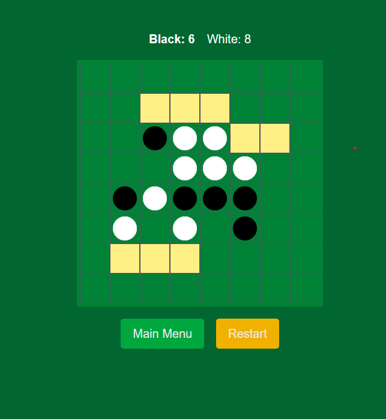

# 🎮 Reversi Game

> A modern implementation of the classic Reversi (Othello) board game built with Next.js and deployed on Render.

[](https://nextjs.org/)
[](https://reactjs.org/)
[](https://www.typescriptlang.org/)
[](https://tailwindcss.com/)
[](https://opensource.org/licenses/MIT)
[](https://render.com/)
[](http://makeapullrequest.com)
[](https://github.com/yourusername/reversi-game/graphs/commit-activity)

<div align="center">
    
    <p><em>Experience the classic board game with a modern interface</em></p>
</div>

<div align="center">
    <a href="https://reversi-game-xa3y.onrender.com">
        
    </a>
</div>

---

## ✨ Features

- **🎮 Multiple Game Modes**
        - `👥 Human vs Human` for classic face-to-face gameplay
        - `🤖 Human vs AI` for solo practice and challenges
        - `⚙️ AI vs AI` simulation for strategy observation
        
- **🧠 Advanced AI Configuration**
        - Three precision-calibrated difficulty levels:
            - `🟢 Easy` - Perfect for beginners
            - `🟡 Medium` - Balanced challenge
            - `🔴 Hard` - Strategic mastermind
        - Fine-tune AI heuristics (disc parity, corner control, mobility)
        - Independent settings for black and white AI players

- **🖱️ Enhanced Interactive Gameplay**
        - Intuitive visual highlighting of valid moves
        - Dynamic move previews on hover
        - Real-time score tracking with animations
        - Clear game state indicators and notifications

- **📱 Responsive Design**
        - Elegant UI powered by Tailwind CSS
        - Optimized for all devices from mobile to desktop
        - Customizable disc colors and board themes

---

## 🛠️ Technology Stack

<table>
    <tr>
        <th>Technology</th>
        <th>Purpose</th>
        <th>Benefits</th>
    </tr>
    <tr>
        <td><a href="https://nextjs.org/"> Next.js</a></td>
        <td>React framework for production</td>
        <td>Server-side rendering, optimized performance</td>
    </tr>
    <tr>
        <td><a href="https://reactjs.org/"> React</a></td>
        <td>Component-based UI library</td>
        <td>Reusable components, reactive updates</td>
    </tr>
    <tr>
        <td><a href="https://www.typescriptlang.org/"> TypeScript</a></td>
        <td>Type safety and developer experience</td>
        <td>Fewer bugs, better tooling</td>
    </tr>
    <tr>
        <td><a href="https://tailwindcss.com/"> Tailwind CSS</a></td>
        <td>Utility-first styling framework</td>
        <td>Rapid UI development, consistent design</td>
    </tr>
    <tr>
        <td><a href="https://render.com/"> Render</a></td>
        <td>Cloud deployment platform</td>
        <td>Simplified deployment, auto-scaling</td>
    </tr>
</table>

---

## 🚀 Getting Started

### Prerequisites

- Node.js 18+ and npm/yarn installed on your development environment

### Installation

<details open>
<summary><b>🔧 Setup Instructions</b></summary>
<br>

1. Clone the repository:
         ```bash
         git clone https://github.com/yourusername/reversi-game.git
         cd reversi-game
         ```

2. Install dependencies:
         ```bash
         npm install
         # or
         yarn install
         ```

3. Start the development server:
         ```bash
         npm run dev
         # or
         yarn dev
         ```

4. Open [http://localhost:3000](http://localhost:3000) in your browser to experience the game.

</details>

---

## 🌐 Deployment

This project is deployed and accessible on Render:

<div align="center">
    <a href="https://reversi-game-xa3y.onrender.com">
        
    </a>
</div>

### Deployment Instructions

<details>
<summary><b>🚢 Step-by-step deployment guide</b></summary>
<br>

1. Fork this repository
2. Create a new Web Service on Render
3. Connect your GitHub repository
4. Configure with the following settings:
         - **Build Command:** `npm run build`
         - **Start Command:** `npm run start`
         - **Node Version:** 18 or higher


</details>

---

## 📋 Game Rules

> *"Easy to learn, a lifetime to master"*

<div style="background-color: #f8f9fa; padding: 15px; border-radius: 5px; margin: 10px 0;">

1. **Initial Setup:** Black always makes the first move
2. **Gameplay:** Players take turns placing discs on the board
3. **Valid Moves:** Each move must capture at least one opponent disc
4. **Capturing:** Discs are captured when flanked by the player's discs
5. **Passing:** If no valid move exists, the player's turn is skipped
6. **Game End:** Play continues until the board is full or no valid moves remain
7. **Winning:** The player with the most discs wins

</div>

<details>
<summary><b>📖 Advanced Rules and Strategy Tips</b></summary>
<br>

### Strategic Concepts

- **Corner Control**: Corners are the most valuable positions
- **Edge Play**: Edges are safer than center positions
- **Mobility**: Maintaining available moves limits opponent options
- **Parity**: The player who makes the last move in each region has an advantage

### Common Patterns

- **X-square**: Position next to corner, dangerous to play
- **C-square**: Two positions away from corner in diagonal
- **Stable Discs**: Cannot be flipped for the remainder of the game

</details>

---

## 🧠 AI Implementation

The game features a sophisticated AI using the minimax algorithm with alpha-beta pruning for optimal performance.

```typescript
function minimax(board, depth, alpha, beta, maximizingPlayer) {
    // Base case
    if (depth === 0 || isGameOver(board)) {
        return evaluateBoard(board);
    }
    
    if (maximizingPlayer) {
        let maxEval = -Infinity;
        // Get all possible moves
        for (const move of getValidMoves(board)) {
            const newBoard = makeMove(board, move);
            const eval = minimax(newBoard, depth - 1, alpha, beta, false);
            maxEval = Math.max(maxEval, eval);
            alpha = Math.max(alpha, eval);
            if (beta <= alpha) break; // Alpha-beta pruning
        }
        return maxEval;
    } else {
        // Minimizing player logic...
    }
}
```

### AI Difficulty Settings

| Level | Search Depth | Heuristics Focus |
|-------|-------------|------------------|
| 🟢 Easy | 2 | Basic disc counting |
| 🟡 Medium | 4 | Balanced strategy with some positional awareness |
| 🔴 Hard | 6+ | Full strategic evaluation (corners, mobility, stability) |

---

## 👥 Contributing

<div align="center">
    
    <p><em>Your contributions make this project better!</em></p>
</div>

1. Fork the repository
2. Create a feature branch (`git checkout -b feature/amazing-feature`)
3. Commit your changes (`git commit -m 'Add some amazing feature'`)
4. Push to the branch (`git push origin feature/amazing-feature`)
5. Open a Pull Request

### Code Style Guidelines

- Follow ESLint configuration
- Write tests for new features
- Keep documentation up-to-date

---

## 🔮 Future Roadmap

- [ ] Add online multiplayer functionality
- [ ] Implement game history and replay feature
- [ ] Create additional board themes and animations
- [ ] Develop advanced AI strategies using machine learning
- [ ] Add tournament mode with leaderboards
- [ ] Implement saved games functionality

---

## 💬 Feedback and Support

<div align="center">
    <a href="https://github.com/yourusername/reversi-game/issues">
        
    </a>
    <a href="https://github.com/yourusername/reversi-game/issues">
        
    </a>
</div>

If you encounter any issues or have suggestions for improvements, please open an issue on the repository. Your feedback helps make this project better for everyone!

---

<div align="center">
    <p>Enjoy playing Reversi! 🎲</p>
    <!-- <p>
        <a href="https://github.com/yourusername/reversi-game/stargazers">
            
        </a>
    </p> -->
    <sub>Made with ❤️ by developers, for developers</sub>
</div>